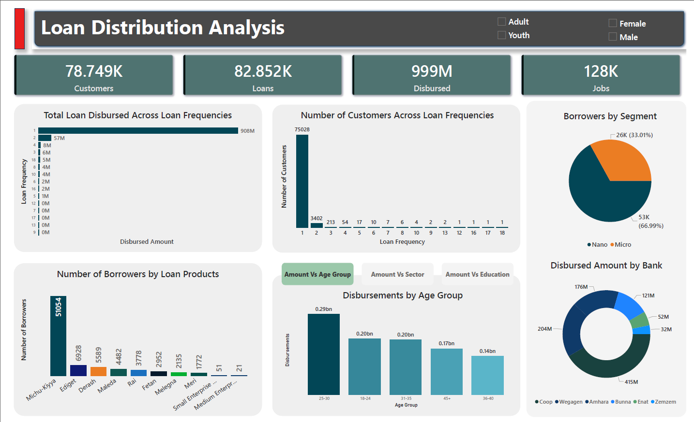

# Loan Distribution Analysis Dashboard

## Overview
This Power BI dashboard provides a comprehensive analysis of loan distribution across customers, loan frequencies, banks, segments, age groups, and products.

## Key Highlights
- Summary metrics related to customers, loans, disbursements, and jobs created.

## Visual Insights
- **Loan Frequency Analysis**:  
  Displays the relationship between loan frequency and disbursed amount.

- **Borrowers by Segment**:  
  Shows the distribution of borrowers across different segments.

- **Loan Product Distribution**:  
  Highlights the number of borrowers by different loan products.

- **Age Group Disbursement**:  
  Visualizes loan disbursement across various age groups.

- **Disbursement by Bank**:  
  Illustrates total disbursement amounts handled by each bank.

## Filters
- Gender: Male, Female  
- Age Category: Adult, Youth

## Purpose
The dashboard aids in identifying borrowing trends, evaluating loan product performance, and assessing demographic-based disbursement to inform financial decision-making and policy design.

## Preview

